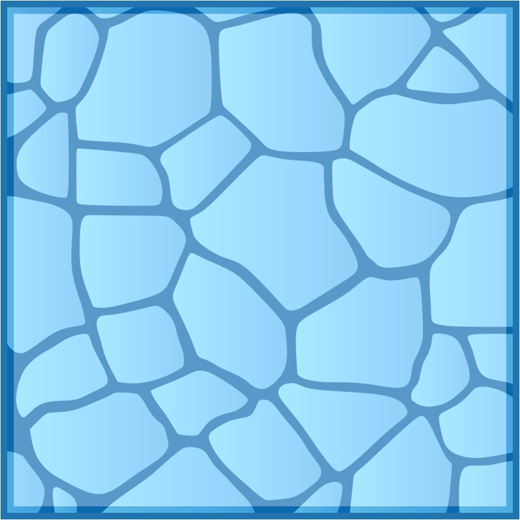
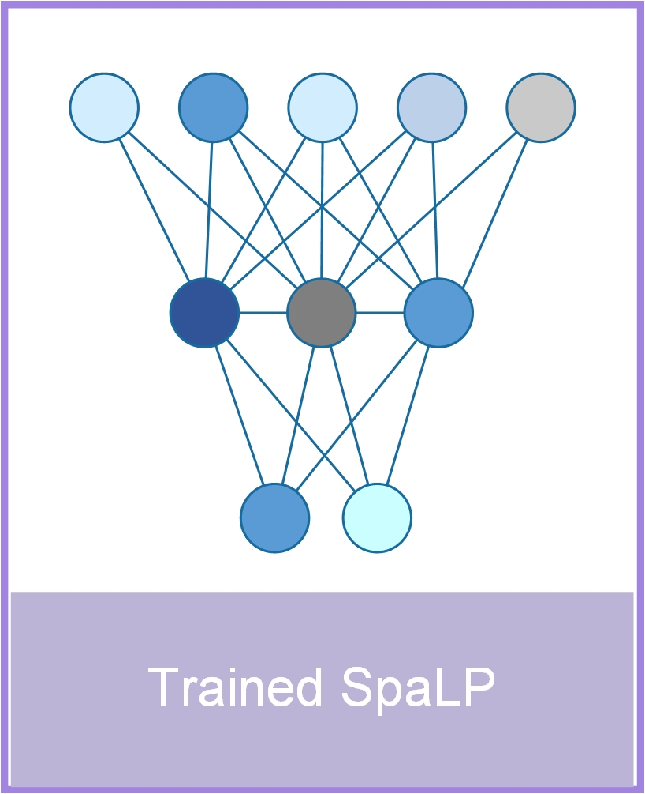

[](https://github.com/dbjzs/SpaLP/blob/main/LICENSE)
[](https://github.com/dbjzs/SpaLP/stargazers)
[](https://spalp.readthedocs.io/en/latest/index.html)
[](https://github.com/dbjzs/SpaLP/forks)


SpaLP (**Spa**tial **L**ocal **P**ooling) is a python package for ultra-large-scale spatial omics data, including spatial atlas building, niche identification, omics data reconstruction, multi-slice integration (within-platform & cross-platform), large-scale multi-omics integration, cross-platform generalized and zero-shot learning.  

## Installation
#### 📥 Download
```
git clone https://github.com/dbjzs/SpaLP.git
cd SpaLP
```
#### 🔧 environment
SpaLP is available for Python 3.10. We recommend to train SpaLP models on a device with GPU support.  
* Using the conda install environment
```
conda create -n SpaLP -c conda-forge python==3.10.13 libopenblas=0.3.25 -y
conda activate SpaLP
```
#### 🛠️package
* Then using pip install SpaLP.
```
pip install -r requirements.txt -i https://pypi.tuna.tsinghua.edu.cn/simple
pip install .
```

### 🚀Getting started Tutorial
 
- Tutorials and API documentation are available at [Tutorial](https://spalp.readthedocs.io/en/latest/index.html).
- Please use [issues](https://github.com/dbjzs/SpaLP/issues) to submit bug reports.
- All experiments were performed on a NVIDIA A800-SXM4-80 GB GPU and Intel(R) Xeon(R) Platinum 8462Y+(32 cores) CPU.
- Running SpaLP following the tutorial should < 1 minute.

### Reference
- If you find SpaLP useful for your research, please consider citing the SpaLP manuscript.
```
@article{Dai?,
  author    = {Dai, et al.},
  title     = {A lightweight, ultrafast and general embedding framework for large-scale spatial omics data},
  journal   = {N.A.},
  year      = {N.A.},
  doi       = {N.A.},
  url       = {N.A.}
}
```
 

### 📁 Tutorial h5ad file
All experiments were performed on a NVIDIA A800-SXM4-80 GB GPU and Intel(R) Xeon(R) Platinum 8462Y+(32 cores) CPU.
####  Fig2

|   Title                     | Download Link                                                                 |  Cells                     |Genes/Protenis| SpaLP Runtime|Platform|
|-----------------------------|----------------------------------------------------------------------|-----------|------|-------------|-------------|
| 640,000 cells Simulation data | [simulatedata.h5ad](https://drive.google.com/open?id=1DnPjxTxS6fLjWtfio__s_yMvgp0zqqhS&usp=drive_fs)       |640,000|31,493 genes|52s|Simulation|
| Xenium Breast Cancer Data     | [Xenium_Breast_Cancer.h5ad](https://drive.google.com/open?id=1StPUArtCFN0oyQLoKN6gQ8n9WlWIAkDl&usp=drive_fs) |167,780|313 genes|7s|Xenium|
| CosMx Mouse Brain     | [CosMxMouseBrain.h5ad](https://drive.google.com/open?id=11aHibK5ZpmI7Ogoru2Y3vDMafP4TTP11&usp=drive_fs)          |48,180 |950 genes|7s|CosMx|

###  Fig3
|   Title                     | Download Link                                                                 |  Cells                     |Genes/Protenis| SpaLP Runtime|Platform|
|-----------------------------|----------------------------------------------------------------------|-----------|------|-------------|-------------|
| 1.35Million Mouse_Tissue     | [Million_Mouse_Tissue.h5ad](https://drive.google.com/open?id=10XtS2L9UgGLqnkPBhJ6UIYdgZ5BICwp5&usp=drive_fs)         |1,355,849|379 genes|47s|Xenium|
| Stereo-seq mouse testes     | [testis.h5ad](https://drive.google.com/open?id=1li92sr3lFebNXjuAP1YOwMZzlKSOA66z&usp=drive_fs)          |198,248|27,869 genes|24s|Stereo-seq V1.3|
| Stereo CITE-seq mouse spleen     | [Stereo_CITE-seq.h5ad](https://drive.google.com/open?id=1VkSMlaeBz020JGZHxVNqW-MKDUmlAaS_&usp=drive_fs)          |295,215|128 proteins|14s|Stereo CITE-seq|

###  Fig4
+ within-platform integration

|   Title                     | Download Link                                                                 | Cells                     |Genes/Protenis| SpaLP Runtime|Platform|
|-----------------------------|----------------------------------------------------------------------|-----------|------|-------------|-------------|
| Coronal mouse brain | [merscope.h5ad](https://drive.google.com/open?id=15L9-qwdgLPdw6A8q2vMjY5nMCwu9J89w&usp=drive_fs)  |734,696|483 genes|47s|MERSCOPE|
| Sagittal mouse brain | [starmap_plus_mouse_cns_batch1.h5ad](https://drive.google.com/open?id=12caAILqWOjDNKiaSYuz9-XMp3bN6CDjA&usp=drive_fs)  |91,246|1022 genes|30s|STARmap PLUS|
| Sagittal mouse brain | [starmap_plus_mouse_cns_batch2.h5ad](https://drive.google.com/open?id=1p3x0_JdCpcjV9AhusrW3OO-y-7lyPRcM&usp=drive_fs)  |123,836|1022 genes|30s|STARmap PLUS|
| Sagittal mouse brain | [starmap_plus_mouse_cns_batch3.h5ad](https://drive.google.com/open?id=1283gLKz04YuakzPnOZ72MF_ScCKGa_je&usp=drive_fs)  |207,591|1022 genes|30s|STARmap PLUS|
|  VisiumHD Tonsil | [FreshFrozenVisiumHDP1.h5ad](https://drive.google.com/open?id=16Hh1T34Cisj41x3QtRphtKG2dtsZ_CC-&usp=drive_fs)  |553,820|18,085 genes|44s|Visium HD|
|  VisiumHD Tonsil | [FFIFVisiumHDP2.h5ad](https://drive.google.com/open?id=11z920Equ8WV4dpPbNeVDCdvNoazT-Gbr&usp=drive_fs)  |679,294|18,085 genes|44s|Visium HD|


+ Cross-platform integration

|   Title                     | Download Link                                                                 | Cells                     |Genes/Protenis| SpaLP Runtime|Platform|
|-----------------------------|----------------------------------------------------------------------|-----------|------|-------------|-------------|
| Cross-platform Mouse Brain  | [MERFISH.h5ad](https://drive.google.com/open?id=16UYRCGe6K5FAMYhoL2-2l7B8mYeCknQq&usp=drive_fs)  |49,430|1122 genes|7s|MERFISH|
| Cross-platform Mouse Brain  | [STARmapPLUS.h5ad](https://drive.google.com/open?id=12cl4ToVZ8AosPshu_NVgmwegFUlY-Ol6&usp=drive_fs)  |43,341|1022 genes|7s|STARmapPLUS|
| Cross-platform Mouse Brain  | [CosMx.h5ad](https://drive.google.com/open?id=1qQRnL-zeWmzSZSlbxOiaKVtCFDB4xUW3&usp=drive_fs)  |48,180|950 genes|7s|CosMx|
| Cross-platform colorectal cancer | [CosMx.h5ad](https://drive.google.com/open?id=1IFnZ6zLNpIe9edVPiVAlktSmQBUFxcEc&usp=drive_fs)  |493,834|10000 genes|57s|CosMx|
| Cross-platform colorectal cancer | [Xeniump1.h5ad](https://drive.google.com/open?id=1k6F_FSWnOVQWhgszttQduiTMl5ULA0AC&usp=drive_fs)  |307,762|422 genes|57s|Xenium|
| Cross-platform colorectal cancer | [VisiumHD_P1.h5ad](https://drive.google.com/file/d/1OX_feTaU8NYL9_CFjQIGG4jrN-slvknT/view?usp=sharing)  |507,684|18,085 genes|57s|Visium HD|
| Cross-platform colorectal cancer | [VisiumHD_P2.h5ad](https://drive.google.com/file/d/1qDWPERNYxaKzYZQd9wG0or2g0SKiKNtX/view?usp=drive_link)  |545,913|18,085 genes|57s|Visium HD|
| Cross-platform colorectal cancer | [VisiumHD_P5.h5ad](https://drive.google.com/file/d/1Rs_BJ2Q9rankWc5zemj0Qbt0Q5fv0bnj/view?usp=drive_link)  |541,968|18,085 genes|57s|Visium HD|


###  Fig5
|   Title                     | Download Link                                                                 | Cells                     |Genes/Protenis| SpaLP Runtime|Platform|
|-----------------------------|----------------------------------------------------------------------|-----------|------|-------------|-------------|
| 8.4 million cells Mouse Brain Atlas     | [MERFISH_animal1.h5ad](https://drive.google.com/open?id=1a1dx_e1HWUSNjrLCh3yV3lfr5T0ve07t&usp=drive_fs)         |4,167,869|1122 genes|3min 41s|MERFISH|
| 8.4 million cells Mouse Brain Atlas     | [MERFISH_animal2.h5ad](https://drive.google.com/open?id=1xTO8Wgs1_6eNeXeQF_3TMgUghrASvdS1&usp=drive_fs)          |1,915,592|1122 genes|3min 41s|MERFISH|
| 8.4 million cells Mouse Brain Atlas     | [MERFISH_animal3_sagittal.h5ad](https://drive.google.com/open?id=1arMwpcExaPCWZGggGFCZ3KDmTydNXNbM&usp=drive_fs)          |2,081,549|1122 genes|3min 41s|MERFISH|
| 8.4 million cells Mouse Brain Atlas     | [MERFISH_animal4.h5ad](https://drive.google.com/open?id=1KW5HgTE3zthYJZ5SnhIBV1LOyiYUN8xv&usp=drive_fs)          |215,278|1122 genes|3min 41s|MERFISH|

###  Fig6
|   Title                     | Download Link                                                                 | Cells                     |Genes/Protenis| SpaLP Runtime|Platform|
|-----------------------------|----------------------------------------------------------------------|-----------|------|-------------|-------------|
| CosMx Kidney cancer self-house data   | [cosmx_kidney.h5ad](https://drive.google.com/file/d/1BaG2ICkXSJ8MSuun9-gMFBYZYAJu_G0D/view?usp=drive_link)         |1,236,281|1000 genes|1min 03s|CosMx|
| Xenium gastric cancer     | [Gastric.h5ad](https://drive.google.com/file/d/17Dcq1gPQP2qXgA2SfbivhssOK4XQonSl/view?usp=drive_link)          |696,314|377 genes|36s|Xenium|
| Xenium multi-omics renal cell carcinoma     | [RNA.h5ad](https://drive.google.com/open?id=1ax2M_z6VX3fEZqpCpfy3RMVyAb76GP7n&usp=drive_fs)     |465,545|396 genes |28s|Xenium|
| Xenium multi-omics renal cell carcinoma     | [Protein.h5ad](https://drive.google.com/open?id=137Kw_5MDjEKD23zfH6u6_fKTBCqfjSFJ&usp=drive_fs)     |465,545|27 proteins |28s|Xenium|


###  Fig7
|   Title                     | Download Link                                                                 | Cells                     |Genes/Protenis| SpaLP Runtime|Platform|
|-----------------------------|----------------------------------------------------------------------|-----------|------|-------------|-------------|
| Pre-training data     | [MERFISH.h5ad](https://drive.google.com/open?id=16UYRCGe6K5FAMYhoL2-2l7B8mYeCknQq&usp=drive_fs)  |49,430|1122 genes|7s|MERFISH|
| Pre-training data     | [STARmapPLUS.h5ad](https://drive.google.com/open?id=12cl4ToVZ8AosPshu_NVgmwegFUlY-Ol6&usp=drive_fs)  |43,341|1022 genes|7s|STARmapPLUS|
| Pre-training data     | [CosMx.h5ad](https://drive.google.com/open?id=1qQRnL-zeWmzSZSlbxOiaKVtCFDB4xUW3&usp=drive_fs)  |48,180|950 genes|7s|CosMx|
| Inference data     | [MERFISH_animal2.h5ad](https://drive.google.com/open?id=1xTO8Wgs1_6eNeXeQF_3TMgUghrASvdS1&usp=drive_fs)  |48,180|1122 genes|1s|C57BL6J-2.041|
| Inference data     | [Stereo-seq:C03937C4.adjusted.h5ad](https://drive.google.com/open?id=1nBGpBO6FnlhCiFxuYAm4SCCxV8MDWYt6&usp=drive_fs)  |70,035|~28,000 genes|1s|Stereo-seq|


###  Exntend Data Fig3
|   Title                     | Download Link                                                                 | Cells                     |Genes/Protenis| SpaLP Runtime|Platform|
|-----------------------------|----------------------------------------------------------------------|-----------|------|-------------|-------------|
| CODEX mouse spleen     | [BALBc-1.h5ad](https://drive.google.com/open?id=1k56uujBkFX0dgtN8GfAX2rdSuXBW7GWI&usp=drive_fs)         |82,251|30 proteins|13s|CODEX|
| CODEX mouse spleen     | [BALBc-2.h5ad](https://drive.google.com/open?id=1Uh8H9yR_G8ZzFzQbxX-G28s5rdov7PaB&usp=drive_fs)         |81,346|30 proteins|12s|CODEX|
| CODEX mouse spleen     | [BALBc-3.h5ad](https://drive.google.com/open?id=106MHMrFNNWp3ouAqy5A4CLIWhx3k6IGD&usp=drive_fs)         |80,636|30 proteins|12s|CODEX|


